Encoder (with GlobalAveragePooling and Linear) and Decoder (billinear with BatchNorm) after 100k steps
_transformer operates on whole frames_

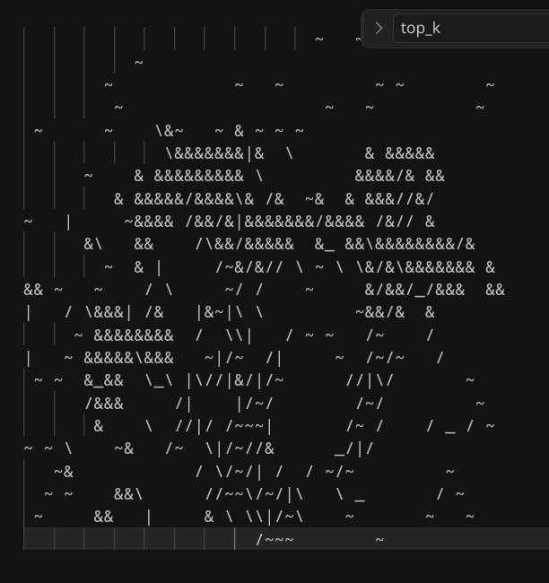

Encoder (without GlobaAveragePooling and Linear) and Decoder (billinear and without BatchNorm) H=3, W=6 after 100k steps
_transformer operates sequentially on patches_

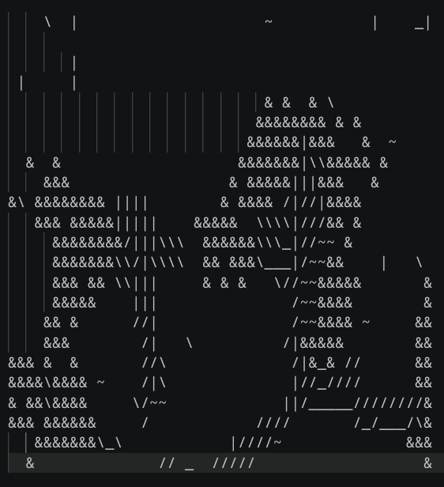

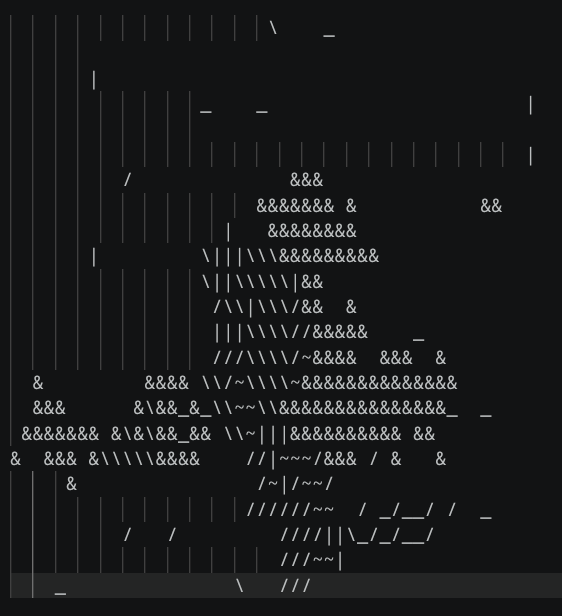

With GAP after 150k steps  

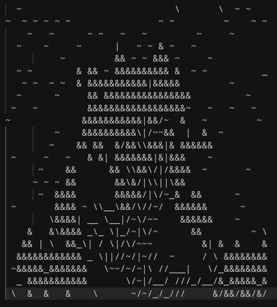
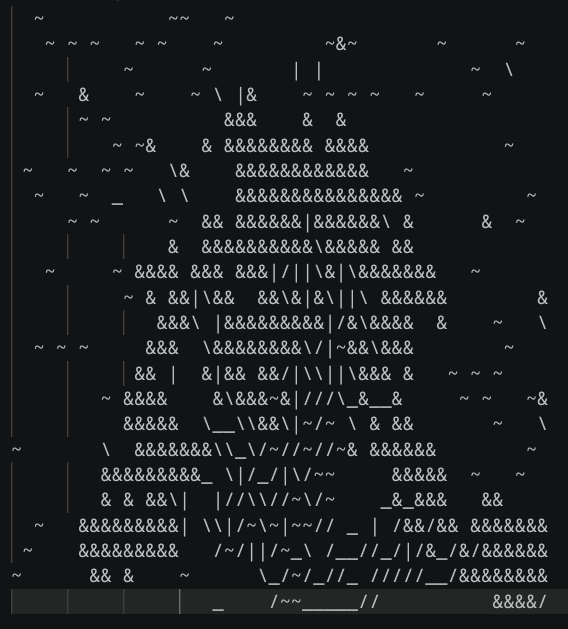

Encoder with linear but without GAP, Decoder with PixelShuffle, without BN after 150k steps  

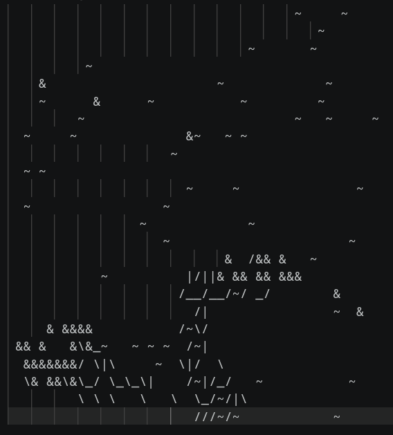

No shape_loss, bigger encoder (128 channels), dropout added, bigger emb, ater 2k steps  
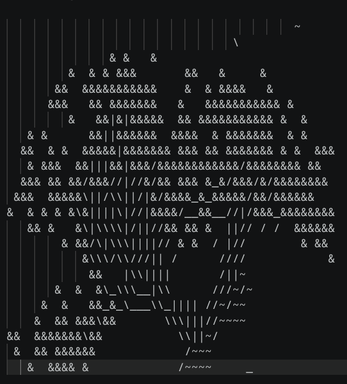
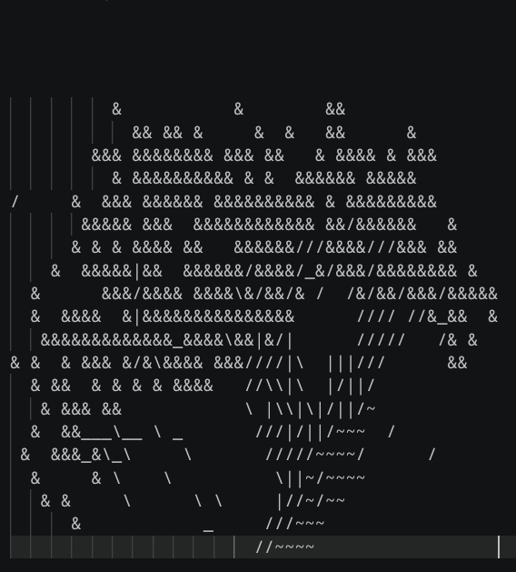

Encoder with FC layers, dropout in enc, entropy penalty  
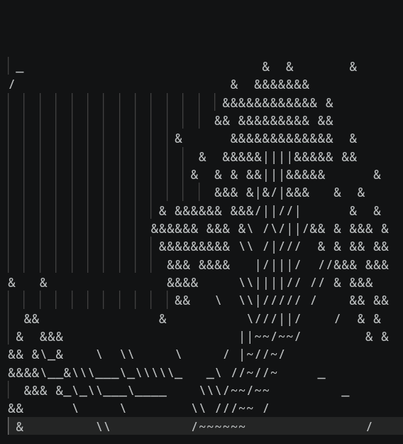
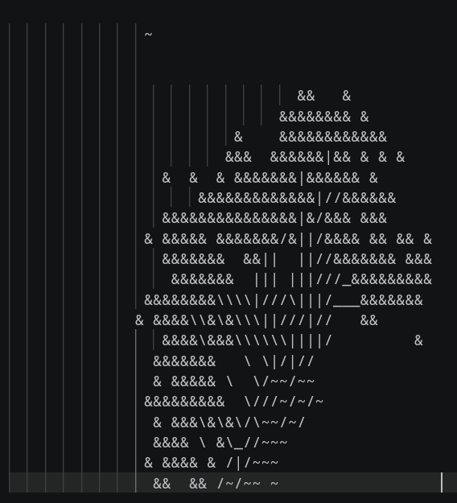  
_generates only these two two types of images_  
_gradient noise made the results worse_

`loss = main_loss + 0.3 * shape_loss + 0.1 * progress_loss + 0.2 * entropy_penalty + 5.0 * isolated_loss + 0.1 * large_wood_loss`  
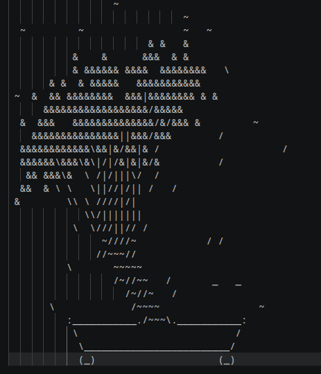
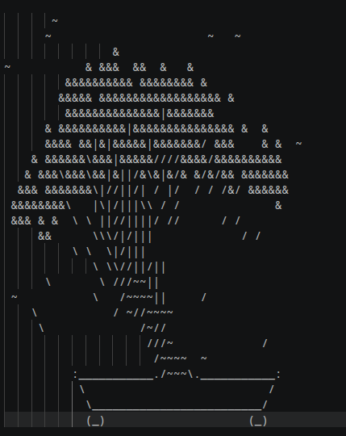
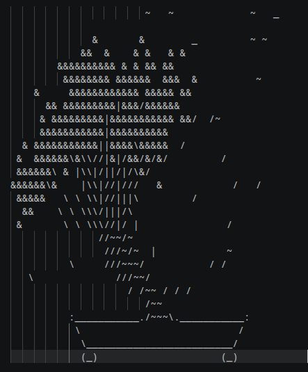

`loss = main_loss + 0.0 * shape_loss + 0.1 * progress_loss + entropy_penalty + 0.1 * large_wood_loss`
large_wood_loss with 6x6 kernel
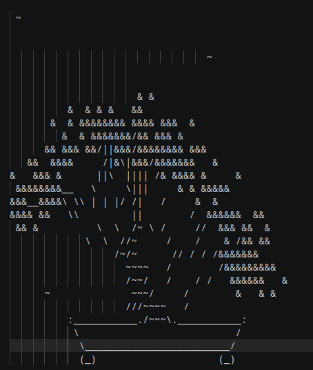
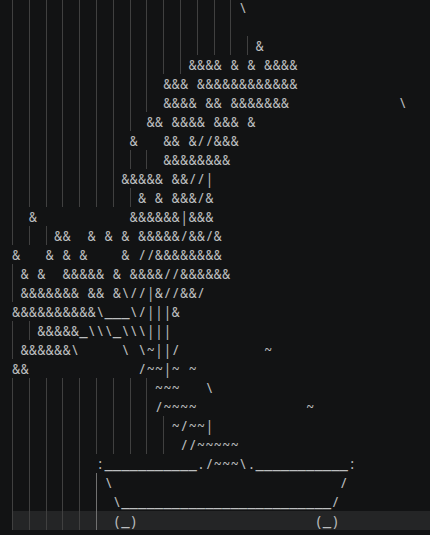
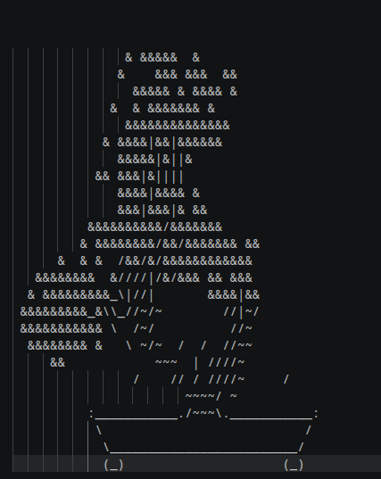
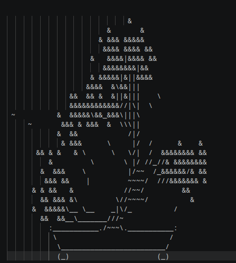
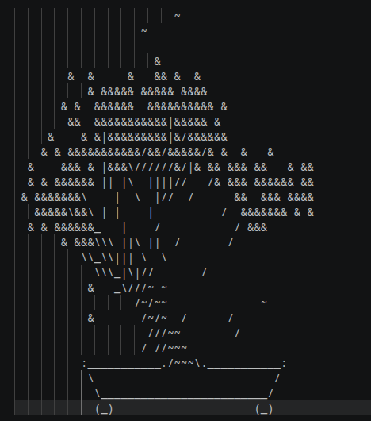
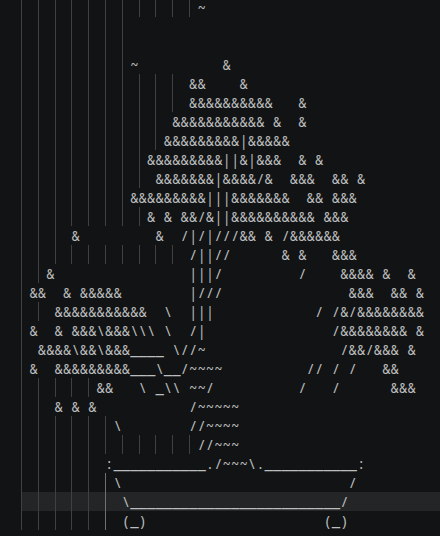
