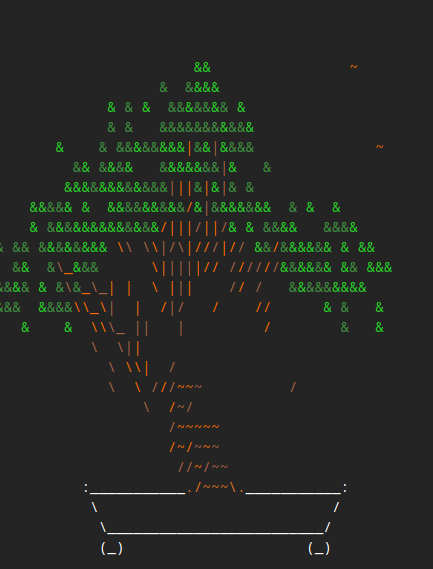
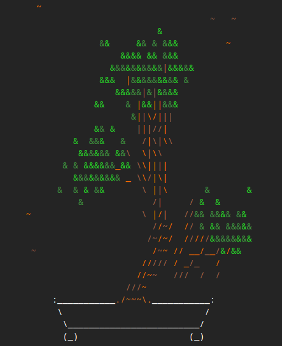
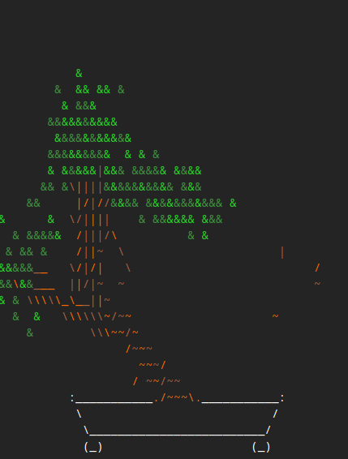
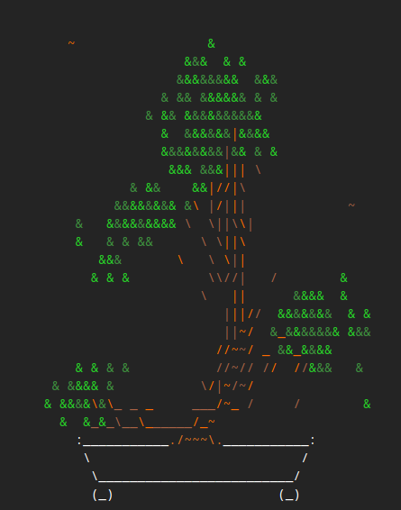
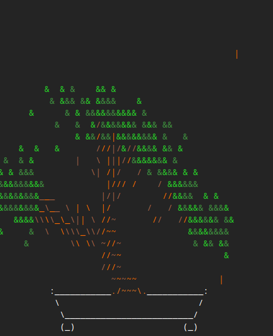
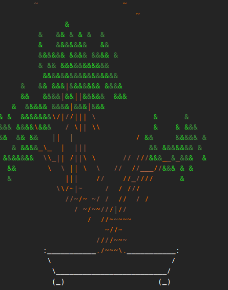

# bonsaigen

A model that generates bonsai trees trained on cbonsai

# [**Try it here**](https://mzums.com/bonsai/)

The API is written in Python using Flask.  
The model outputs 24x48 ascii trees which are colored randomly, the original base is added and the result is converted into html.

## Model

This is a GPT2-like model with a convolutional decoder and encoder

- Encoder:
  - ~10.3M parameters
  - 3 convolutional layers
  - 2 MaxPool layers
  - Batch Normalization
  - 2 fully connected (FC) layers
  - ReLU activations
  - Dropout

- GPT:
  - ~85M parameters
  - embedding size of 768
  - vocab_size of 7
  - 12 Transformer layers
  - 12 attention heads
  - context length of 256 previous frames
  - dropout of 0.2

- Decoder:
  - ~7.5M parameters
  - 2 transposed convolutional (deconvolutional) layers
  - 2 convolutional layers
  - 1 FC layer
  - ReLU activations

Total: ~102.8M parameters.

## Dataset

The model was trained on trees generated using from [cbonsai](https://gitlab.com/jallbrit/cbonsai).  
First trees are generated in a small terminal window, then the base is cropped. Final trees used for training are 24x48 pixels.  
For details see [get_data/main.py](get_data/main.py).

## Tokenization

Each tree is a combination of 7 characters (including ` ` and `\n`) and is tokenized to numbers 0-6

## Future updates

- Growth animation
- Diffusion model
- GAN model
- VAE model

## Development process

To see how my changes influenced the results head to [roadmap.md](roadmap.md)

## Local development

1. Clone the repo  
   `git clone https://github.com/mzums/bonsaigen`
2. Enter the directory  
   `cd bonsaigen`
3. Create conda evironment  
   `conda create --name bonsaigen python=3.12`
4. Activate the environment  
   `conda activate bonsaigen`
5. Install dependencies  
   `pip install -r requirements.txt`
6. Get data  
   `cd get_data`  
   `python main.py`
7. Run cells in `ml/explore.ipynb`
8. Run training  
   `cd ml/gpt_conv/enc`  
   `python train.py`
9. Generate trees  
   `python generate.py`
10. Run API  
    `cd api`  
    `python app.py`

## Credits

This model is based on the implementation in Andrej Karpathy's [_Zero to Hero_](https://karpathy.ai/zero-to-hero.html) series, although it contains a custom dataloader, a convolutional encoder and decoder and a lot of my comments, explanations, experiments and the API.

It also wouldn't exist without the original [cbonsai](https://gitlab.com/jallbrit/cbonsai) - my favourite command line program.

## Gallery

