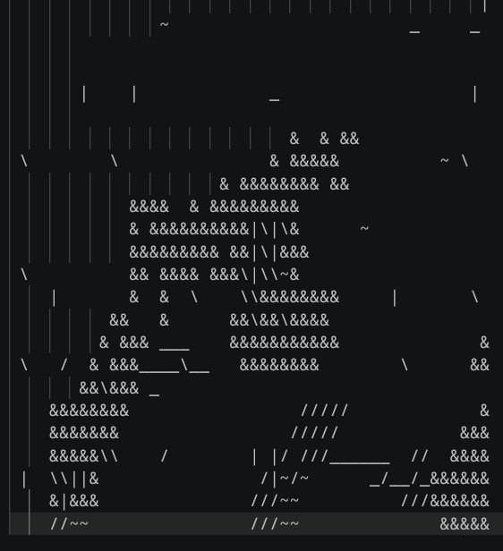
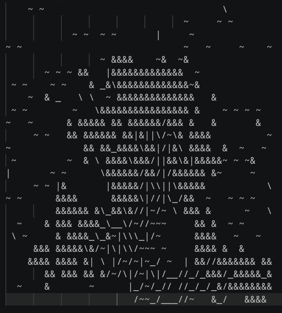
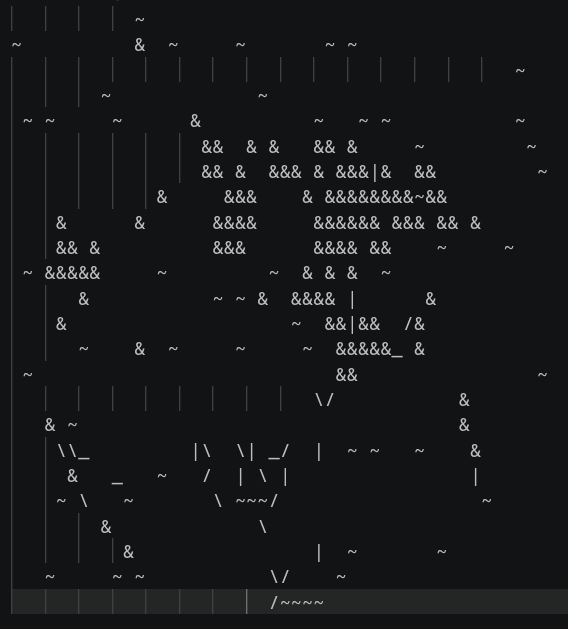
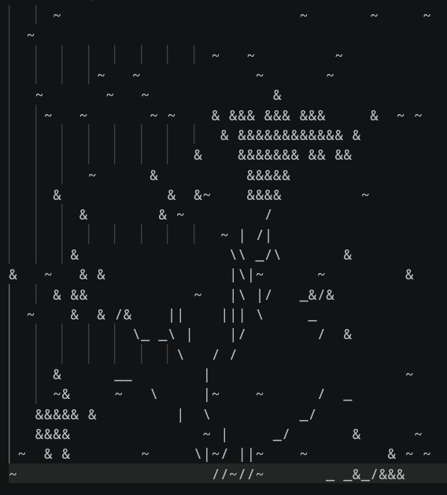

Encoder (with GlobalAveragePooling and Linear) and Decoder (billinear with BatchNorm) after 100k steps
*transformer operates on whole frames*

Encoder (without GlobaAveragePooling and Linear) and Decoder (billinear and without BatchNorm) H=3, W=6 after 100k steps
*transformer operates sequentially on patches*

With GAP after 150k steps

Encoder with linear but without GAP, Decoder with PixelShuffle, without BN

